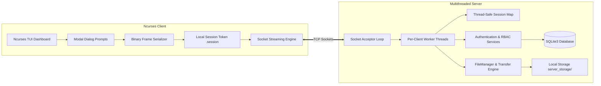

# Enterprise File Sharing System (EFSS)

A multithreaded C++17 client-server networked file sharing system featuring server-enforced Role-Based Access Control (RBAC), custom binary protocol framing, advisory file locking, cryptographic file validation (SHA-256), SQLite audit trails, and an interactive Ncurses Terminal User Interface (TUI).

---

## High-Level Architecture

EFSS uses a decoupled, layered client-server architecture built on POSIX Berkeley sockets and custom application-layer framing. Security enforcement, permission validation, and storage routing are strictly isolated to the server engine.



---

## Subsystem Architecture & Responsibilities

### 1. Network & Protocol Layer

* **`NetworkServer`**: Manages the socket lifecycle, client accept loops, and connection worker threads. Maintains an in-memory thread-safe session map (`active_sessions`) guarded by `std::mutex session_mutex` to map tokens to active users.
* **`NetworkClient`**: Encapsulates socket connections, deserializes server responses, manages local credentials (`.session`), and drives the TUI state machine.
* **`protocol.h`**: Enforces binary-level packet framing. All operations use packed structs (`#pragma pack(push, 1)`) to eliminate struct padding mismatches across architectures.

### 2. Security, Authentication & Domain Models

* **`AuthenticationService`**: Decoupled service layer that queries SQLite through `Database::authenticateUser()`, managing user credentials and session roles.
* **`PermissionService`**: Static authorization utility verifying access policies across system operations (`canUpload`, `canDownload`, `canDelete`, `canRename`).
* **`User` Domain Hierarchy (`User.h`)**: Polymorphic object-oriented model representing domain users:
* `User` (Abstract Base Class)
* `Admin` (`canDelete() = true`)
* `Faculty` (`canDelete() = true`)
* `Student` (`canDelete() = false`)


### 3. Storage, File Integrity & Transfer Engine

* **`FileManager`**: Wraps low-level POSIX file operations (`open`, `read`, `write`) with memory-safe `std::vector<char>` buffers. Implements reader/writer advisory file locking primitives (`acquireReadLock`, `acquireWriteLock`, `releaseLock`) to prevent race conditions during concurrent transfers, alongside SHA-256 checksum calculation (`calculateSHA256`).
* **`TransferService`**: Coordinates socket streaming and file management. Implements chunked transmission logic (`sendFile`, `receiveFile`) and verifies integrity hashes over the wire.

### 4. Persistence & Audit Trails (`Database`)

* Encapsulates SQLite3 operations using prepared statements (`sqlite3_prepare_v2`) and parameterized bindings to eliminate SQL injection vulnerabilities.
* Manages schemas for `users`, `files`, and `transfers`, and runs an automatic First-Time Bootstrapping Wizard if the database contains zero provisioned users.

---

## Protocol Specification

All exchanges across the network communicate using a fixed 40-byte packed header followed immediately by an optional dynamic payload.

### Packet Header (`PacketHeader`)

```c
#pragma pack(push, 1)
struct PacketHeader {
    uint16_t magic;             // Magic identifier: 0xABCD
    uint8_t  opcode;            // Command operation code (1 - 12)
    uint8_t  filename_len;      // Length of filename or target argument string
    uint32_t payload_size;      // Size of incoming payload in bytes
    char     session_token[32]; // Client authentication token / username
};

struct AuthPayload {
    char username[32];          // Null-terminated username
    char password[32];          // Null-terminated password
};
#pragma pack(pop)

```

### Opcodes

| Opcode ID | Enumerator | Direction | Payload Description |
| --- | --- | --- | --- |
| `1` | `UPLOAD` | Client → Server | `PacketHeader` + filename + binary file chunks |
| `2` | `DOWNLOAD` | Client → Server | `PacketHeader` + target filename |
| `3` | `ACK` | Server → Client | Response confirmation (`payload_size` bytes) |
| `4` | `AUTH` | Client → Server | `PacketHeader` + `AuthPayload` struct |
| `5` | `LIST` | Client → Server | Directory listing request |
| `6` | `DELETE_FILE` | Client → Server | Remote file deletion request |
| `7` | `RENAME_FILE` | Client → Server | Remote rename payload (`oldName|newName`) |
| `8` | `FILE_INFO` | Client → Server | Target filename for size, checksum, and attributes |
| `9` | `CREATE_DIR` | Client → Server | Directory name string |
| `10` | `REMOVE_DIR` | Client → Server | Directory name string |
| `11` | `SEARCH` | Client → Server | Substring search query string |
| `12` | `HISTORY` | Client → Server | Request transfer and audit history logs |

---

## Role-Based Access Matrix

| System Operation | Admin | Faculty | Student | Guest / Unauthenticated |
| --- | --- | --- | --- | --- |
| **Authenticate (`AUTH`)** | Yes | Yes | Yes | N/A |
| **List Files (`LIST`)** | Yes | Yes | Yes | Denied |
| **Download (`DOWNLOAD`)** | Yes | Yes | Yes | Denied |
| **Search Repository (`SEARCH`)** | Yes | Yes | Yes | Denied |
| **Inspect Metadata (`FILE_INFO`)** | Yes | Yes | Yes | Denied |
| **Upload File (`UPLOAD`)** | Yes | Yes | Yes | Denied |
| **Create Directory (`CREATE_DIR`)** | Yes | Yes | Denied | Denied |
| **Remove Directory (`REMOVE_DIR`)** | Yes | Yes | Denied | Denied |
| **Delete File (`DELETE_FILE`)** | Yes | Yes | Denied | Denied |
| **Rename File (`RENAME_FILE`)** | Yes | Yes | Denied | Denied |
| **View Audit Trails (`HISTORY`)** | Yes | Yes | Denied | Denied |
| **User Account Provisioning** | Yes | Denied | Denied | Denied |

---

## Database Schema

Persistence is handled by SQLite (`database/file_sharing.db`).

```sql
-- User Accounts
CREATE TABLE IF NOT EXISTS users (
    id INTEGER PRIMARY KEY AUTOINCREMENT,
    username TEXT UNIQUE NOT NULL,
    password TEXT NOT NULL,
    role TEXT NOT NULL,
    home_directory TEXT,
    created_at DATETIME DEFAULT CURRENT_TIMESTAMP
);

-- File Metadata & Cryptographic Hashes
CREATE TABLE IF NOT EXISTS files (
    id INTEGER PRIMARY KEY AUTOINCREMENT,
    owner_id INTEGER,
    filename TEXT NOT NULL,
    path TEXT NOT NULL,
    size INTEGER,
    checksum TEXT,
    created_at DATETIME DEFAULT CURRENT_TIMESTAMP,
    modified_at DATETIME DEFAULT CURRENT_TIMESTAMP,
    FOREIGN KEY(owner_id) REFERENCES users(id)
);

-- Transfer & Security Audit Logs
CREATE TABLE IF NOT EXISTS transfers (
    id INTEGER PRIMARY KEY AUTOINCREMENT,
    user_id INTEGER,
    filename TEXT NOT NULL,
    operation TEXT NOT NULL,
    size INTEGER,
    status TEXT,
    timestamp DATETIME DEFAULT CURRENT_TIMESTAMP,
    FOREIGN KEY(user_id) REFERENCES users(id)
);

```

---

## Repository Directory Structure

```
.
├── Makefile                     # Build automation script
├── database/
│   └── file_sharing.db          # SQLite runtime database (untracked)
├── docs/                        # Architectural diagrams and documentation
├── downloads/                   # Default client download target directory
├── include/                     # System header declarations
│   ├── AuthenticationService.h  # Authentication service interface
│   ├── Database.h               # SQLite database wrapper
│   ├── FileManager.h            # POSIX I/O, file locking, SHA-256
│   ├── NetworkClient.h          # Client socket controller
│   ├── NetworkServer.h          # Multithreaded TCP server controller
│   ├── PermissionService.h      # Static RBAC policy check engine
│   ├── TransferService.h        # Network file transfer manager
│   ├── User.h                   # OOP Polymorphic User domain hierarchy
│   └── protocol.h               # Binary packet headers, opcodes, payloads
├── server_storage/              # Isolated repository root directory
│   ├── documents/
│   ├── public/
│   ├── temporary/
│   ├── test/
│   └── users/
├── src/                         # Implementation source files
│   ├── AuthenticationService.cpp
│   ├── Database.cpp
│   ├── FileManager.cpp
│   ├── NetworkClient.cpp
│   ├── NetworkServer.cpp
│   ├── PermissionService.cpp
│   ├── TransferService.cpp
│   ├── main_client.cpp          # Ncurses TUI Dashboard
│   └── main_server.cpp          # Server entry point
└── tests/                       # Test harnesses and mock inputs

```

---

## Dependencies & Environment

* **Target OS**: Linux (Ubuntu 22.04 / 24.04 LTS, Debian, or WSL2)
* **Compiler**: `g++` (C++17 or higher)
* **System Libraries**:
* `libsqlite3-dev` (Database storage engine)
* `libncurses5-dev` / `libncursesw5-dev` (Terminal UI Dashboard)
* `libssl-dev` (OpenSSL cryptographic routines for SHA-256)
* `pthread` (POSIX threading)


Install all prerequisites on Ubuntu / Debian:

```bash
sudo apt update
sudo apt install -y build-essential g++ libsqlite3-dev libncurses-dev libssl-dev

```

---

## Build & Run

### 1. Compilation

Build both `file_server` and `file_client` via `make`:

```bash
make clean && make

```

*Manual Compilation Command:*

```bash
# Compile Server
g++ -Wall -Wextra -std=c++17 src/main_server.cpp src/NetworkServer.cpp src/TransferService.cpp \
    src/FileManager.cpp src/Database.cpp src/AuthenticationService.cpp src/PermissionService.cpp \
    -o file_server -pthread -lsqlite3 -lssl -lcrypto

# Compile Client
g++ -Wall -Wextra -std=c++17 src/main_client.cpp src/NetworkClient.cpp \
    -o file_client -lncurses

```

### 2. Launch the Server

Run the server daemon (default port: `8080`):

```bash
./file_server

```

> On the very first launch, if `database/file_sharing.db` is empty, the server automatically prompts the administrator wizard in the console to configure the Root Admin account and default user policies.

### 3. Launch the Client

Open a second terminal window:

```bash
./file_client

```

1. Enter your provisioned username and password in the **EFSS SECURE LOGIN** modal.


2. Navigate the dashboard using the **Up/Down Arrow keys** and **Enter**.


```
