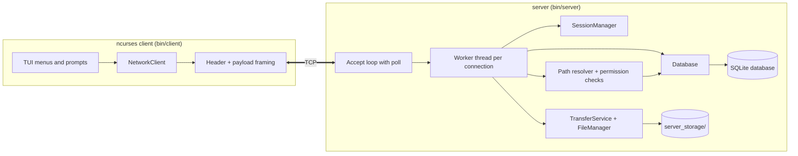

# Enterprise File Sharing System (EFSS)

A multithreaded C++17 client-server file sharing system for Linux. A server daemon stores files, users and audit data; an ncurses terminal client lets users log in, browse a shared `public/` area and their personal `home/` area, and move files between them. Access is controlled by admin-managed role permissions that the server enforces on every request.

---

## Table of Contents

1. [Features](#features)
2. [Architecture](#architecture)
3. [Storage Model](#storage-model)
4. [Users, Roles and Permissions](#users-roles-and-permissions)
5. [Authentication and Sessions](#authentication-and-sessions)
6. [Wire Protocol](#wire-protocol)
7. [Database Schema](#database-schema)
8. [Security Measures](#security-measures)
9. [Build and Run](#build-and-run)
10. [Using the Client](#using-the-client)
11. [Example Walkthrough](#example-walkthrough)
12. [Configuration](#configuration)
13. [Project Structure](#project-structure)
14. [Known Limitations](#known-limitations)

---

## Features

- Client-server design on POSIX TCP sockets with a custom binary protocol.
- Thread-per-connection server with a capped number of concurrent clients.
- Two storage areas per user: a shared `public/` and a private `home/` that acts as the user's personal storage.
- Nested folders, upload, download (copy into home), rename and move, delete, mkdir, rmdir, file info and recursive search.
- Role-based access control (Admin, Faculty, Student) with read, write and delete flags per role and per storage area, editable by an Admin at runtime.
- Admin tools in the client: list, add and remove users, change roles, view and edit role permissions.
- Salted PBKDF2 password hashing, random session tokens, idle expiry and per-IP login throttling.
- Atomic uploads (temp file, then rename), advisory file locking, and a SHA-256 hash stored for every upload.
- Audit trail of every operation, including denied attempts, viewable by Admin and Faculty.
- First-run setup wizard that creates the initial Admin account.

---

## Architecture



**Request flow.** Each client request opens a short-lived TCP connection, sends one request, reads one reply and closes. The server thread reads the header, then either handles `AUTH` or validates the session token. After validation it re-reads the user's role from the database, so role changes and deleted accounts take effect immediately. It then resolves the requested path, checks the role's permission flag for that storage area, performs the operation, writes an audit row and replies.

**Components**

| Component | Responsibility |
| --- | --- |
| `NetworkServer` | Socket setup, accept loop, signal-based shutdown, request dispatch, path resolution and permission checks |
| `NetworkClient` | Connects, sends requests, parses replies, keeps the session token in memory |
| `main_client` | ncurses login screen, dashboard, prompts and admin menus |
| `SessionManager` | Thread-safe token store with idle expiry and failed-login lockout per IP |
| `AuthenticationService` | Verifies credentials through `Database` |
| `Database` / `DatabaseAdmin` | SQLite access with prepared statements and one recursive mutex; users, files, transfers, role policy |
| `TransferService` | Chunked file receive (temp file then atomic rename) and send |
| `FileManager` | POSIX file operations, advisory locking, directory listing, file info, SHA-256 |
| `Crypto` | PBKDF2 hashing, constant-time verify, random hex tokens |
| `SetupWizard` | Console wizard that provisions the first Admin |
| `PermissionService` | Known-role check and the fixed audit-log rule |
| `net_io` | `readExact`, `writeAll`, header encode and decode, reply helpers, socket timeouts |
| `PathUtils` | Name validation (`isSafeName`) and `baseName` |
| `config.h` | Central constants (paths, limits, timeouts) |

---

## Storage Model

Every user sees two roots:

| Root | Server location | Visibility |
| --- | --- | --- |
| `public/` | `server_storage/public` | shared by all users |
| `home/` | `server_storage/users/<username>` | private to that user |

All paths in the client are written as `public/<path>` or `home/<path>`, for example `public/reports/q1.txt` or `home/notes.txt`. Nested folders are supported.

**Path safety.** Each path component must pass `isSafeName`: 1-255 characters, not `.` or `..`, with no `/`, `\`, `|` or control characters. After building the real path, the server canonicalizes it and rejects anything that resolves outside the root (this blocks symlink escapes). Root folders themselves cannot be deleted, renamed or overwritten.

**Operations by root**

- **Upload** sends a local file to `public/...` or `home/...`. A destination ending in `/` (or just `public` / `home`) keeps the local file name. The default is `home/`.
- **Download** copies a file on the server into the caller's own home. The default is `home/<name>`. A custom destination is a path inside home (`docs/`, `docs/new.txt` or `home/docs/new.txt`); an existing folder keeps the file name. A destination can never leave home.
- **Rename / move** accepts a new path in either root. `home/a.txt` to `public/a.txt` moves the file between roots.
- **List** with a blank path shows both roots; a path such as `public/docs` lists that folder.
- **Search** is a case-insensitive file name match across both roots, capped at 200 results, returned with `public/` or `home/` prefixes.

Server layout:

```
server_storage/
├── public/    shared files
├── users/     one folder per user (their home)
└── tmp/       staging area for uploads and copies (same filesystem, so rename is atomic)
```

---

## Users, Roles and Permissions

Three roles exist: **Admin**, **Faculty** and **Student**. Permissions are stored per role and per storage area in the `role_policy` table and are read on every request.

| Flag | Covers |
| --- | --- |
| Read | list, file info, search, download (as a source) |
| Write | upload, rename, mkdir, saving a download into home |
| Delete | delete file, rmdir, overwrite files owned by others |

**Defaults (seeded on first start)**

| Role | public (R/W/D) | home (R/W/D) |
| --- | --- | --- |
| Admin | 1 / 1 / 1 | 1 / 1 / 1 |
| Faculty | 1 / 1 / 1 | 1 / 1 / 1 |
| Student | 1 / 1 / 0 | 1 / 1 / 1 |

An Admin can change any of these from the client without restarting the server.

**Fixed rules (not configurable)**

- Only Admin can add or remove users, change roles and edit permissions.
- Admin and Faculty can view the audit log.
- Moving a file between roots needs Delete on the source root and Write on the destination root.
- Overwriting an existing file needs Delete permission on that root or ownership of the file.
- An Admin cannot remove or re-role their own account, so at least one Admin always remains.
- Removing a user ends their access immediately. Their audit rows remain but show no username, and their home folder is kept on disk.

---

## Authentication and Sessions

1. The client sends `AUTH` with a username and password (each 1-31 characters).
2. The server verifies the password against a salted PBKDF2-HMAC-SHA256 hash (600,000 iterations, 16-byte salt). Rows from an older plaintext database are accepted once and upgraded to a hash on that login.
3. On success the server creates a random 128-bit session token (32 hex characters) and replies `SUCCESS:<role>:<token>`.
4. The client keeps the token in memory only and sends it in the header of every later request.
5. Sessions expire after 30 minutes without activity (sliding window) and are destroyed on logout.
6. After 5 failed logins from one IP address, that IP is locked out for 60 seconds. Each failed login also incurs a 300 ms delay, and unknown users take about as long as wrong passwords to avoid user enumeration by timing.

---

## Wire Protocol

Every message starts with a fixed 40-byte packed header. Multi-byte fields use network byte order.

```c
#pragma pack(push, 1)
struct PacketHeader {
    uint16_t magic;             // 0xABCD
    uint8_t  opcode;
    uint8_t  filename_len;      // length of the name/argument string that follows
    uint32_t payload_size;      // body bytes after the name
    char     session_token[32]; // not NUL-terminated
};
struct AuthPayload {
    char username[32];
    char password[32];
};
#pragma pack(pop)
```

A request is: header, then `filename_len` bytes of name/argument, then `payload_size` bytes of body. A reply is an `ACK` header (with `payload_size` bytes of body, 0 meaning plain OK) or an `ERROR_REPLY` header followed by a text message.

| Opcode | Name | Name / argument field | Body |
| --- | --- | --- | --- |
| 1 | UPLOAD | `public/...` or `home/...` | file bytes (max 256 MiB) |
| 2 | DOWNLOAD | remote path | reply streams the file (kept for streaming clients; the menu uses opcode 21) |
| 3 | ACK | | reply |
| 4 | AUTH | empty | `AuthPayload` |
| 5 | LIST | path, or empty for both roots | |
| 6 | DELETE_FILE | remote path | |
| 7 | RENAME_FILE | `old|new` | |
| 8 | FILE_INFO | remote path | |
| 9 | CREATE_DIR | remote path | |
| 10 | REMOVE_DIR | remote path | |
| 11 | SEARCH | query | |
| 12 | HISTORY | empty | |
| 13 | ERROR_REPLY | | message |
| 14 | LOGOUT | empty | |
| 15 | ADD_USER | `user|role|password` | |
| 16 | REMOVE_USER | username | |
| 17 | SET_ROLE | `user|role` | |
| 18 | LIST_USERS | empty | |
| 19 | SET_POLICY | `role|scope|r|w|d` (flags 0 or 1) | |
| 20 | LIST_POLICY | empty | |
| 21 | COPY_FILE | `source` or `source|dest-in-home` | reply body = saved path |

Every opcode except `AUTH` requires a valid session token. The protocol is not encrypted (see limitations).

---

## Database Schema

SQLite file at `database/file_sharing.db`, opened in WAL mode with foreign keys on and a 5 second busy timeout.

```sql
CREATE TABLE users (
    id INTEGER PRIMARY KEY AUTOINCREMENT,
    username TEXT UNIQUE NOT NULL,
    password TEXT NOT NULL,            -- pbkdf2-sha256$iterations$salt$hash
    role TEXT NOT NULL,
    home_directory TEXT,
    created_at DATETIME DEFAULT CURRENT_TIMESTAMP
);

CREATE TABLE files (
    id INTEGER PRIMARY KEY AUTOINCREMENT,
    owner_id INTEGER,
    filename TEXT NOT NULL,
    path TEXT NOT NULL,
    size INTEGER,
    checksum TEXT,                     -- SHA-256 hex
    created_at DATETIME DEFAULT CURRENT_TIMESTAMP,
    modified_at DATETIME DEFAULT CURRENT_TIMESTAMP,
    FOREIGN KEY(owner_id) REFERENCES users(id)
);

CREATE TABLE transfers (
    id INTEGER PRIMARY KEY AUTOINCREMENT,
    user_id INTEGER,
    filename TEXT NOT NULL,
    operation TEXT NOT NULL,
    size INTEGER,
    status TEXT,
    timestamp DATETIME DEFAULT CURRENT_TIMESTAMP,
    FOREIGN KEY(user_id) REFERENCES users(id)
);

CREATE TABLE role_policy (
    role TEXT NOT NULL,
    scope TEXT NOT NULL,               -- 'public' or 'home'
    can_read INTEGER NOT NULL,
    can_write INTEGER NOT NULL,
    can_delete INTEGER NOT NULL,
    PRIMARY KEY(role, scope)
);
```

All queries use prepared statements with bound parameters. The audit log (`transfers`) records operations such as `UPLOAD`, `DOWNLOAD`, `DELETE`, `RENAME`, `MKDIR`, `RMDIR`, `ADD_USER`, `REMOVE_USER`, `SET_ROLE` and `SET_POLICY`, with statuses like `SUCCESS`, `FAILED` and `DENIED_RBAC`. The client shows the 50 most recent entries. Passwords are never written to the log.

---

## Security Measures

- **Server-side enforcement.** The client menu is only a convenience; every permission is checked on the server using the role read fresh from the database.
- **Password storage.** Salted PBKDF2-HMAC-SHA256 with constant-time comparison.
- **Session tokens.** Cryptographically random, memory-only, idle-expiring, destroyed on logout or when the account is removed.
- **Brute-force protection.** Per-IP lockout, fixed failure delay and timing equalization for unknown users.
- **Path traversal and symlink protection.** Component validation plus canonical-path containment check; downloads open files with `O_NOFOLLOW`.
- **Resource limits.** 256 MiB upload cap, 64 concurrent clients, 30 second socket read/write timeouts, bounded reply sizes.
- **Safe uploads.** Data goes to a temp file under an exclusive lock and is renamed into place only when complete, so failed uploads leave nothing behind and readers never see partial files.
- **Log hygiene.** Client-controlled text is sanitized before it reaches the console log.
- **Least privilege files.** Files are created with mode 0640 and directories with 0750.

---

## Build and Run

**Requirements:** Linux (Ubuntu 22.04/24.04, Debian or WSL2), `g++` with C++17, and the development packages below.

```bash
sudo apt update
sudo apt install -y build-essential libsqlite3-dev libncurses-dev libssl-dev
```

**Build**

```bash
make clean && make
```

This produces `bin/server` and `bin/client`.

**Run the server** (default port 8080, run it from the project root so relative paths resolve):

```bash
./bin/server            # or ./bin/server 9000
```

On the first start with an empty database, a console wizard asks for the root Admin username and password (password 8-31 characters, hidden input) and can optionally create more users. Press Ctrl+C for a clean shutdown; the server waits up to 10 seconds for active clients.

**Run the client** (second terminal):

```bash
./bin/client                # 127.0.0.1:8080
./bin/client 192.168.1.10 9000
```

---

## Using the Client

Log in on the **EFSS SECURE LOGIN** screen, then use the Up/Down arrows and Enter.

| Menu item | What it does |
| --- | --- |
| 1. List Files | Blank path shows `public/` and `home/`; or enter a path to list one folder |
| 2. Upload File | Local file path, then destination (`public/`, `home/`, `home/dir/` or a full path) |
| 3. Download File (to home) | Remote path, then optional path inside home (blank = `home/`) |
| 4. Search Files | Name substring search across both roots |
| 5. View File Info | Size, permissions and last modified time |
| 6. Create Directory | e.g. `home/docs` or `public/shared` (parent must exist) |
| 7. Remove Directory | Directory must be empty |
| 8. Delete File | Needs Delete permission on that root |
| 9. Rename / Move File | Current path, new path; can move between roots |
| 10. View Transfer Audit Log | Admin and Faculty only |
| 11. Manage Users & Permissions | Admin only (see below) |
| 0. Logout | Ends the session on the server |

**Admin menu (11):** list users, add user (name, role, password), remove user, change a user's role, show role permissions, and set role permissions (role, scope `public` or `home`, flags such as `1,1,0` for read, write, delete).

After each command the client returns to the console to show the result; press Enter to go back to the dashboard.

---

## Example Walkthrough

1. Start the server and create the Admin `admin` in the wizard.
2. Log in as `admin`, open **11 > Add User**, create `alice` with role `Student`.
3. As `admin`, upload `report.pdf` to `public/`.
4. Log in as `alice`. **List Files** shows `report.pdf` under `[public/]` and an empty `[home/]`.
5. Alice chooses **Download**, enters `public/report.pdf`, leaves the destination blank. The file is copied to `home/report.pdf`.
6. Alice uploads `notes.txt` with destination `home/`, then renames `home/notes.txt` to `public/notes.txt` to share it.
7. Alice tries **Delete File** on `public/report.pdf`. The server denies it because Students have no Delete on `public` by default, and the attempt is logged as `DENIED_RBAC`.
8. The Admin opens **11 > Set Role Permissions**, sets `Student`, `public`, `1,1,1`. Alice's next delete succeeds without logging in again.

---

## Configuration

Server settings live in `include/config.h` (rebuild after changing):

| Constant | Default | Meaning |
| --- | --- | --- |
| `DEFAULT_PORT` | 8080 | Listening port (overridden by the first argument) |
| `MAX_CLIENTS` | 64 | Concurrent connections |
| `SOCKET_TIMEOUT_SEC` | 30 | Per recv/send timeout |
| `SESSION_IDLE_SEC` | 1800 | Idle session expiry |
| `MAX_LOGIN_FAILURES` | 5 | Failures per IP before lockout |
| `LOCKOUT_SEC` | 60 | Lockout duration |
| `FAILED_LOGIN_DELAY_MS` | 300 | Delay after a failed login |
| `MIN_PASSWORD_LEN` / `MAX_CRED_LEN` | 8 / 31 | Password and credential length limits |
| `STORAGE_ROOT`, `USERS_DIR`, `TEMP_DIR`, `DB_PATH` | see file | Storage and database locations |

The upload limit (`MAX_UPLOAD_SIZE`) is in `include/protocol.h`.

---

## Project Structure

```
.
├── Makefile
├── README.md
├── database/                    SQLite database (created at runtime, untracked)
├── server_storage/              public/, users/, tmp/ (created at runtime, untracked)
├── include/
│   ├── AuthenticationService.h
│   ├── config.h                 server constants
│   ├── Crypto.h                 hashing and random tokens
│   ├── Database.h
│   ├── FileManager.h
│   ├── net_io.h                 socket read/write and header helpers
│   ├── NetworkClient.h
│   ├── NetworkServer.h
│   ├── PathUtils.h              name validation and baseName
│   ├── PermissionService.h
│   ├── protocol.h               header, opcodes, limits
│   ├── SessionManager.h
│   ├── SetupWizard.h
│   ├── TransferService.h
│   └── User.h                   legacy polymorphic user classes (not used by the server)
└── src/
    ├── AuthenticationService.cpp
    ├── Crypto.cpp
    ├── Database.cpp             core schema, users, audit and file records
    ├── DatabaseAdmin.cpp        role policy, user admin, file ownership
    ├── FileManager.cpp
    ├── main_client.cpp          ncurses UI
    ├── main_server.cpp
    ├── net_io.cpp
    ├── NetworkClient.cpp
    ├── NetworkServer.cpp        dispatch, path resolution, permission checks
    ├── PermissionService.cpp
    ├── SessionManager.cpp
    ├── SetupWizard.cpp
    └── TransferService.cpp
```

---

## Known Limitations

- **No transport encryption.** Passwords, tokens and files travel in clear text. Use a trusted network or a TLS tunnel such as `stunnel` or an SSH port forward.
- **Per-IP lockout.** Users behind one NAT share the failure counter.
- **Rename race.** The "destination exists" check and the rename are separate steps, so a concurrent request could slip between them.
- **Directory renames.** Renaming a folder does not update the stored paths of files inside it, which affects only ownership lookups for overwrite checks.
- **Audit history after user removal.** Rows for a removed user lose the username.
- **Removed users keep their home folder** on disk; creating a user with the same name later reuses it.
- **File size.** The protocol uses 32-bit sizes, so the practical ceiling is 4 GiB; uploads are capped at 256 MiB.
- **Thread shutdown.** Worker threads are detached; shutdown waits up to 10 seconds for them.
- **Client display.** Results are printed after leaving the ncurses screen, so very long listings scroll in the terminal.
